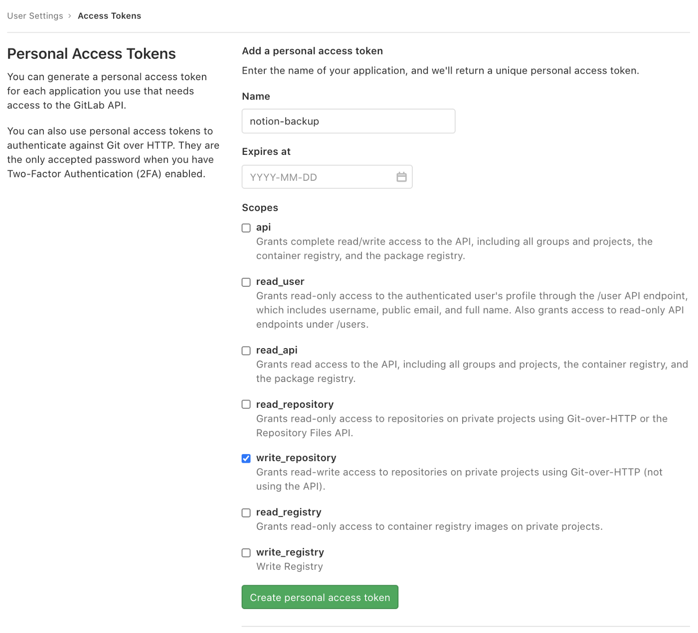
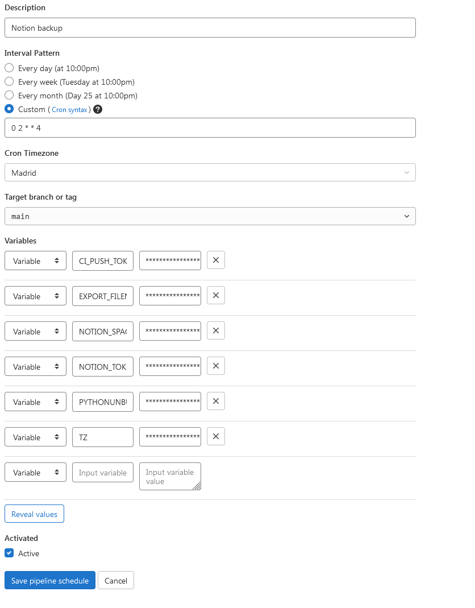

### Backups automáticos de Notion con GitLab

Notion es mi herramienta perfecta para mantenerme organizado, pero una de las pegas que le he encontrado a este sistema es que la incapacidad de poder recuperar los datos con alguna copia de seguridad. Tus datos con Notion se supone que está en la nube y es verdad que puedes exportar tu contenido en Markdown, ¿pero y si de repente sus sistemas fallan? 

¿Y si al volver te encuentras sin tus datos? 

(que no podrías exportar porque ya no están)

Pues la solución es programar una copia de seguridad automática. 

Quizá haya otros métodos mejores (sobre todo si tienes muchos archivos grandes alojados en Notion), pero creo que mi uso puede ser el de muchos, así que aquí os cuento como la he programado yo de forma semanal. Para ello necesitareis una cuenta de Notion y de GitLab.

Thanks for the help, [Artur Burtsev](https://artur-en.medium.com/automated-notion-backups-f6af4edc298d).

## 1. Consigue el token de Notion y su spaceID

Puede que haya otras maneras de hacerlo, pero cuando empecé a investigar sobre las maneras de acceder al funcionamiento de Notion para imitarlo y poder hacer backups por mi cuenta, solo encontré esto.

1. En tu navegador (yo usé Google Chrome), primero tienes que abrir la pagina web de Notion (e iniciar sesión con tu cuenta si no lo estás ya)

2. Una vez iniciada sesión, arriba a la izquierda en la barra lateral, accede a la sección de "Settings & Members"

3. Una vez allí, haz click la sección de Settings (justo debajo del titular de WORKSPACE)

4. Abre las Chrome DevTools y ve a la pestaña Network

5. En esa pestaña activa el filtro XHR

6. Limpia la consola

7. Con las DevTools abiertas, pulsa en la opción de Notion de "Exportar todo el contenido"

8. La pestaña de Network se habrá actualizado y a la izquierda verás diferentes procesos. Pulsa en "enqueueTask"

9. Una vez abierta en la pestaña Headers tan solo tienes que buscar en cookie el valor de token_v2, guárdalo bien en un archivo.

10. Desplázate hacia el fondo y debajo de la sección Request Payload" enncontrarás el spaceId, guarda esto bien en otro archivo.

## 2. Crear un token para poder realizar las copias en GitLab

1. En GitLab accede a los User Settings y a la sección de Acces Tokens. 

Puedes llamarlo como quieras, pero asegúrate de que tengas rellenado lo demás como en esta captura de pantalla.

2. Una vez lo hayas creado, verás que tienen un Personal Access Token. Guárdalo bien porque solo lo verás esa vez.

## 3. Crear el repositorio en GitLab para guardar el backup automatizado

1. Crea un nuevo proyecto. 

Puede ser público o privado, pero en Notion puedes haber guardado de todo y preferir que solo tú mismo puedas acceder a los archivos Markdown de Notion de la copia de seguridad.

2. Una vez creado, pulsa el botón "Set up CI/CD".

3. Te encontrarás con una ventana para escribir un script. Puedes copiar el contenido del archivo que tengo alojado en mi repositorio: "gitlab-ci.yml" y pulsar en el botón "Commit changes".

Este script lo que hará es descargar todo tu contenido de Notion en la carpeta backup, en vez de en un ZIP (que es lo que conseguirías con la opción de Exportar todo mi contenido que he mencionado al principio de esta explicación).

## 4. Programa el backup automático

1. Una vez el script esté guardado, en el menú de la izquierda selecciona "Schedules" dentro de "CI/CD".

2. Una vez dentro de Schedules, pulsa el botón de "Schedule" y apareceras en el formulario de "Schedule a new pipeline"

3. Aquí te dejo mi patrón, pero puede no ser el que quieras. 

Si no manejas la sintaxis de Cron puedes configurarlo cada día, cada semana o cada mes desde el propio formulario con pulsar su opción. 

4. También selecciona tu zona horaria.

Puedes tener una distinta a la mía (Madrid) y eso afectará a la hora a la que realizará el proceso.

5. En las variables tienes que introducir estos valores:

- CI_PUSH_TOKEN -> el valor del Personal Access Token que habías guardado

- EXPORT_FILENAME -> /tmp/export.zip

- NOTION_SPACE_ID -> el valor de spaceId que habías guardado

- NOTION_TOKEN_V2 -> el valor de token_v2 que habías guardado

- PYTHONUNBUFFERED -> 1

- TZ -> el valor de tu zona horaria, puedes consultarlo [aquí](https://en.wikipedia.org/wiki/List_of_tz_database_time_zones).

6. Con esto intrdoucido, ya puedes pulsar el botón "Save pipeline schedule".

## 5. Prueba el backup que has automatizado

En Schedules ahora aparecerá el que has creado. Puedes pulsar el botón "Play" para asegurarte de que funcionará correctamente después de realizar este intento manual. Después de unos minutos el círculo de log aparecerá en verde si se ha realizado el proceso con exito. 

Si no, revisa de nuevo esta explicación y asegúrate de que las has seguido al pie de la letra.

Una vez hecho el proceso puedes volver a la página del proyecto que has creado y verás que se ha creado una carpeta llamada backup. Ahí dentro podrás encontrar tu workspace de Notion en diferentes archivos Markdown. Puedes descargarlos si quieres tener una copia en tu equipo, ten en cuenta que estos se actualizarán cuando se haga el primero backup automático después de tu intento manual.

## 6. Disfruta de Notion y de la libertad de que tienes todo tu contenido

Ya no te tienes que preocupar de problemas con Notion y su nube. Puedes importar tu contenido en caso de que lo hubiera gracias a estos backups automatizados. 

### ¡Espero haberte ayudado! Si te ha servido de ayuda, puedes [invitarme a un café](https://www.buymeacoffee.com/arturocode). ¡Te lo agradecería mucho!
